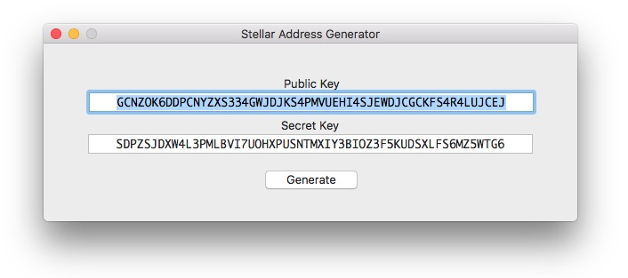

# StellarAddress

**StellarAddress** is a basic app to get you started using the [StellarSDK](https://github.com/kuyawa/StellarSDK) framework.

Clone or download the repo and play with it to explore the endless possibilities that offers the Stellar Network.

For instructions on how to use the SDK please refer to the user guide in [StellarSDK](https://github.com/kuyawa/StellarSDK).

